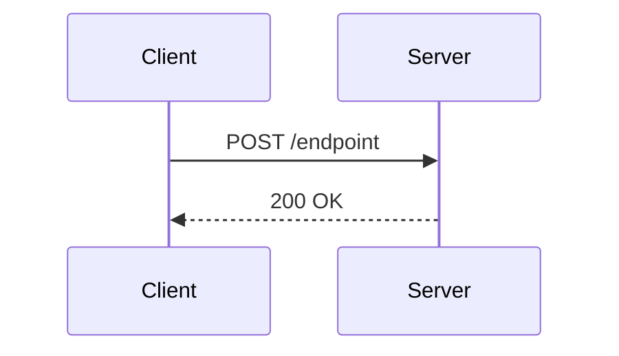

# Phase 28: Audit & Test Strategy - Research

**Researched:** 2026-02-22
**Domain:** System Documentation (Mermaid/Markdown), Cloudflare Workers Testing (Vitest/D1), End-to-End Testing (Playwright)
**Confidence:** HIGH

## Summary

This phase focuses on documenting the system flows and generating a concrete test strategy without writing the actual tests yet. The main goals are to formally map out the cryptographic authentication (DPoP, Ed25519) and subscription (Stripe) edge cases based on the existing `docs/v1` and codebase, and to design the test framework configuration to handle them.

For system flow documentation, the standard approach is using Markdown coupled with Mermaid.js for sequence diagrams. For the testing strategy, `@cloudflare/vitest-pool-workers` offers the most accurate simulation of the `workerd` runtime (critical for Web Crypto API parity in auth flows) and provides a declarative way to spin up ephemeral D1 databases per test. On the E2E side, `@playwright/test` uniquely supports isolated browser contexts (`browser.newContext()`), enabling native multi-actor testing (e.g., User + Agent flows).

**Primary recommendation:** Formalize flows in a two-part format (Quick Glance + Detailed API Trace with Mermaid sequence diagrams). Dictate a test strategy that explicitly uses `vitest-pool-workers` with `applyD1Migrations` for backend isolation and Playwright `BrowserContext` for multi-actor E2E scenarios.

## Standard Stack

The established libraries/tools for this domain:

### Core
| Library | Version | Purpose | Why Standard |
|---------|---------|---------|--------------|
| Mermaid.js | Built-in | Flow sequence diagrams | Natively rendered by GitHub/GitLab and IDEs |
| `@cloudflare/vitest-pool-workers` | 0.12.x | Backend integration tests | Provides exact Web Crypto API parity and native D1 binding injection |
| `@playwright/test` | 1.58.x | E2E testing | Native multi-context, multi-tab, and iframe support |

### Alternatives Considered
| Instead of | Could Use | Tradeoff |
|------------|-----------|----------|
| Cypress | Playwright | Cypress struggles with multiple domains, cross-origin iframes, and isolated concurrent sessions which are critical for agent claim flows and Stripe Elements. |
| Jest / Node `crypto` | Vitest Pool Workers | Testing Web Crypto using Node's standard `crypto` module often leads to false positives; the `workerd` runtime has specific algorithm constraints that only `vitest-pool-workers` can catch locally. |

## Architecture Patterns

### Recommended Flow Documentation Structure
The audit requires two formats per flow. They should be structured within `docs/v1/` as follows:

```markdown
### Flow Name: [Name]

#### 1. Quick Glance
1. [Actor A] does [Action]
2. [Actor B] receives [Result]

#### 2. Sequence Diagram


#### 3. Detailed API Trace
- **Endpoint:** `POST /endpoint`
- **Request Payload:** `{ ... }`
- **Response Payload:** `{ ... }`
- **Edge Cases:**
  - *List specific failures (e.g., Invalid Signature, Rate Limited)*
```

### Pattern 1: D1 Ephemeral Database Seeding
**What:** Using `applyD1Migrations` and `env.DB` bindings in `vitest.config.ts` to spin up a fresh, migrated database per test runner.
**When to use:** For all backend integration tests to ensure tests run in parallel without state leakage.
**Example:**
```typescript
// vitest.config.ts
import { defineWorkersProject, readD1Migrations } from "@cloudflare/vitest-pool-workers/config";

export default defineWorkersProject(async () => {
	const migrations = await readD1Migrations(path.join(__dirname, "migrations"));
	return {
		test: {
			setupFiles: ["./test/apply-migrations.ts"], // Calls `applyD1Migrations(env.DB, env.TEST_MIGRATIONS)`
			poolOptions: {
				workers: { miniflare: { bindings: { TEST_MIGRATIONS: migrations } } }
			}
		}
	};
});
```

### Pattern 2: Playwright Multi-Context Testing
**What:** Creating separate browser contexts to simulate different users/agents simultaneously in the same test.
**When to use:** E2E testing of overseer operations, subscription transfers, or multi-tenant claim flows.
**Example:**
```typescript
import { test, expect } from '@playwright/test';

test('User and Agent claim interaction', async ({ browser }) => {
  const userContext = await browser.newContext();
  const agentContext = await browser.newContext();
  
  const userPage = await userContext.newPage();
  const agentPage = await agentContext.newPage();
  
  // Test realtime synchronization or claim handoffs between the two pages
});
```

## Don't Hand-Roll

| Problem | Don't Build | Use Instead | Why |
|---------|-------------|-------------|-----|
| Sequence Diagrams | Custom SVG or Canvas diagrams | Mermaid.js | Plain-text, diff-able in Git, and universally supported. |
| DB Mocking | Custom in-memory JS maps or SQL.js wrappers | `vitest-pool-workers` D1 Miniflare bindings | Accurately tests SQLite features and limitations native to Cloudflare D1. |
| Webhook Auth Bypasses | Custom `if (process.env.TEST)` bypass flags | Directly inject signed payloads in tests | Bypassing auth masks real cryptographic issues (like signature parsing or timestamp expiry). |

## Common Pitfalls

### Pitfall 1: Testing Cryptography outside of `workerd`
**What goes wrong:** Auth flow tests (DPoP/Ed25519) pass locally but fail in production.
**Why it happens:** Node.js Web Crypto implementation occasionally accepts formats or key material that the stricter Cloudflare `workerd` environment rejects.
**How to avoid:** The test strategy must enforce running all cryptographic validation tests via `cloudflare:test` using `SELF.fetch()` or direct function calls within the worker context.

### Pitfall 2: Stripe Sandbox State Leakage
**What goes wrong:** Subscription upgrade/downgrade E2E tests fail intermittently because the Stripe Sandbox retains test states across different test runs.
**Why it happens:** Reusing the same test Customer or Subscription ID.
**How to avoid:** The testing strategy must document that *each* E2E test must dynamically generate a new Stripe Customer and tear it down, or rely on mocked local webhook ingestion instead of real Stripe API calls.

### Pitfall 3: Ignoring Time-Based Cryptographic Edge Cases
**What goes wrong:** Replay attacks or expired DPoP tokens are undocumented.
**Why it happens:** Audit only focuses on the happy path.
**How to avoid:** The audit documentation must explicitly outline test scenarios for:
- Reused Nonces / JWT IDs (`jti`).
- Expired Issued At (`iat`) claims.
- Mismatched HTTP Method (`htm`) or URI (`htu`).

## Code Examples

### Direct Webhook Injection for Integration Tests
To test subscription edge cases without hitting the real Stripe API, document this strategy:
```typescript
import { SELF } from "cloudflare:test";

it("handles subscription cancellation webhook", async () => {
  const mockEvent = { type: "customer.subscription.deleted", data: { object: { id: "sub_123" } } };
  
  // Sign the mock payload with the test webhook secret
  const signature = generateStripeSignature(mockEvent, env.STRIPE_WEBHOOK_SECRET);
  
  const response = await SELF.fetch("https://example.com/api/webhooks/stripe", {
    method: "POST",
    headers: { "Stripe-Signature": signature },
    body: JSON.stringify(mockEvent)
  });
  
  expect(response.status).toBe(200);
});
```

## Open Questions

1. **Stripe E2E Environment Isolation**
   - What we know: E2E tests will require testing real frontend flows.
   - What's unclear: Will Playwright tests interact with a real Stripe Sandbox or use completely mocked checkout elements?
   - Recommendation: The test strategy should specify using Stripe's official Test Mode cards within real Stripe Elements in Playwright, but intercepting the backend webhooks locally to avoid rate limits.

## Sources

### Primary (HIGH confidence)
- `@cloudflare/vitest-pool-workers` Official GitHub (`cloudflare/workers-sdk/fixtures/vitest-pool-workers-examples/d1`) - Validated D1 migration binding injection.
- Playwright Official Documentation (`playwright.dev/docs/browser-contexts`) - Validated for `browser.newContext()` multi-tenant scenarios.

## Metadata

**Confidence breakdown:**
- Standard stack: HIGH - Direct API alignment with Cloudflare's officially supported testing mechanisms.
- Architecture: HIGH - Mermaid is the de facto standard; Playwright Multi-context is specifically requested by the architectural decisions.
- Pitfalls: HIGH - Cryptographic parity issues and DB/Sandbox state leakage are the most common failures in this exact stack setup.

**Research date:** 2026-02-22
**Valid until:** 2026-08-22